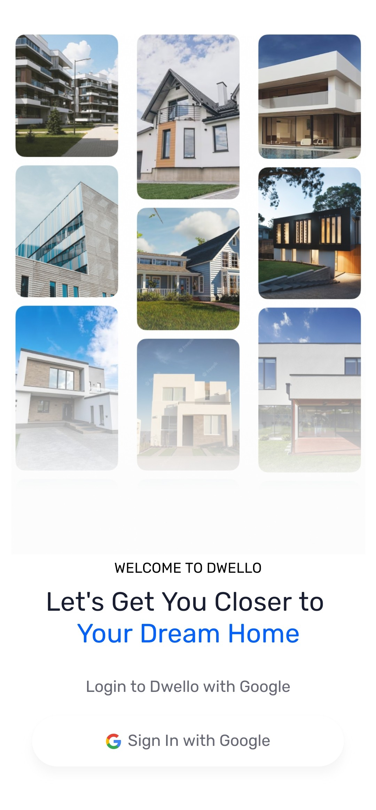
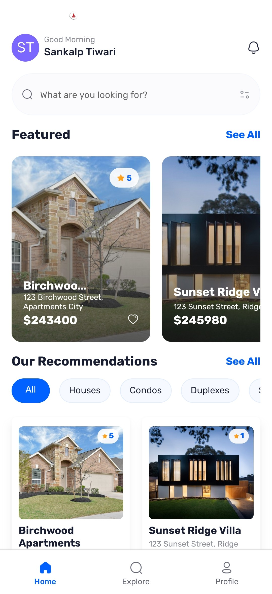
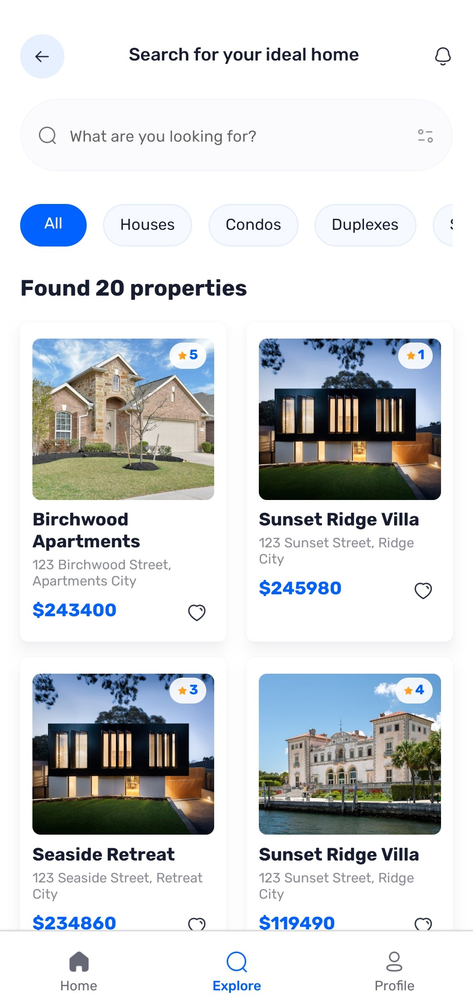
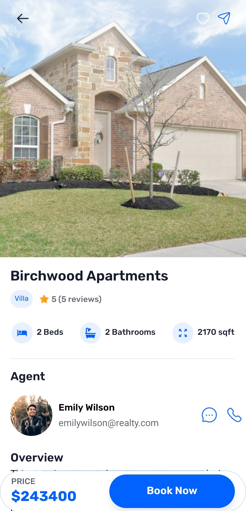
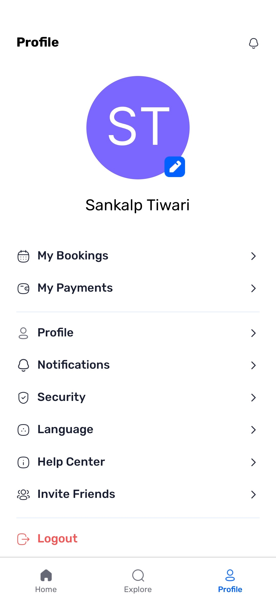

# Dwello

## 📌 Project Overview
Dwello is a real estate mobile application built with React Native and Expo, designed to simplify property discovery and transactions. It integrates **Google OAuth** for authentication, **Appwrite** for backend services, **Expo Router** for navigation, and **nativewind** for styling, ensuring a seamless and modern user experience.


## 🖼️ Preview
<div align="center" style="display: flex; flex-wrap: wrap; justify-content: center; gap: 10px;">
  
  
  
  <br/>
  
  
  
</div>

## ✨ Features
- **Real Estate Listings**: Browse and search for properties based on various filters.
- **Google OAuth Integration**: Secure authentication via Google login.
- **Smooth Navigation**: Expo Router-based navigation for an intuitive experience.
- **Custom UI Components**: Reusable UI components for a better user experience.
- **Optimized Performance**: Efficient state management and debounced search with `use-debounce`.
- **Centralized Data Fetching**: Custom-built solution inspired by TanStack’s useQuery for efficient API calls.

   and many more, including code architecture and reusability

## 🛠 Tech Stack
- **Frontend**: React Native, Expo
- **Backend**: Appwrite (Authentication, Database, Storage)
- **Navigation**: Expo Router
- **Styling**: Tailwind CSS, NativeWind
- **Additional Libraries**: WebView, Reanimated, Gesture Handler

## 🚀 Installation & Setup
### Prerequisites
Ensure you have the following installed:
- [Git](https://git-scm.com/)
- [Node.js](https://nodejs.org/en)
- [npm](https://www.npmjs.com/) (Node Package Manager)

### Steps to Run Locally
1. Clone the repository:
   ```sh
   git clone https://github.com/Sankalp20Tiwari/dwello.git
   cd dwello
   ```
2. Install dependencies:
   ```sh
   npm install
   ```
3. Create a new file named .env.local in the root of your project and add the following   content:
   ```js
   EXPO_PUBLIC_APPWRITE_PLATFORM=
   EXPO_PUBLIC_APPWRITE_PROJECT_ID=
   EXPO_PUBLIC_APPWRITE_ENDPOINT=
   EXPO_PUBLIC_APPWRITE_DATABASE_ID=
   EXPO_PUBLIC_APPWRITE_AGENTS_COLLECTION_ID=
   EXPO_PUBLIC_APPWRITE_GALLERIES_COLLECTION_ID=
   EXPO_PUBLIC_APPWRITE_REVIEWS_COLLECTION_ID=
   EXPO_PUBLIC_APPWRITE_PROPERTIES_COLLECTION_ID=
   ```
 Replace the values with your actual Appwrite credentials. You can obtain these credentials  by signing up & creating a new project on the [Appwrite](https://appwrite.io/)

4. Start the development server:
   ```sh
   npx expo start
   ```

In the output, you'll find options to open the app in a

- [development build](https://docs.expo.dev/develop/development-builds/introduction/)
- [Android emulator](https://docs.expo.dev/workflow/android-studio-emulator/)
- [iOS simulator](https://docs.expo.dev/workflow/ios-simulator/)
- [Expo Go](https://expo.dev/go), a limited sandbox for trying out app development with Expo

You can start developing by editing the files inside the **app** directory. This project uses [file-based routing](https://docs.expo.dev/router/introduction).   

## 📁 Folder Structure
```
Dwello/
│── app/
│   ├── (root)/         
│       ├── (tabs)/      # App screens (Home, Profile, Explore)
│       ├── properties/  # Property screens 
│       ├── _layout.tsx  # Root pages layout
│   ├── _layout.tsx      # App main layout 
│   ├── globals.css      # Global css file
│   ├── sign-in.tsx      # Sign In page
│── assets/              # Static assets (images, icons)
│── components/          # Reusable UI components
│── constants/           # Dummy data and images
│── lib/                 # Utility functions
│── public/              # Public folder containing images
│── node_modules/        # Dependencies
│── package.json         # Project metadata
│── app.json             # Expo configuration
```

## 🎯 Usage
- Launch the app and authenticate using Google OAuth.
- Browse and search for real estate listings.
- Experience real-time data updates with Appwrite database.
- View detailed property descriptions using WebView.

## 🤝 Contributing
Contributions are welcome! Follow these steps:
1. Fork the repository.
2. Create a new branch: `git checkout -b feature-name`
3. Make your changes and commit: `git commit -m "Added new feature"`
4. Push changes: `git push origin feature-name`
5. Submit a pull request.

---
Feel free to update the repository link and Appwrite credentials as needed!


